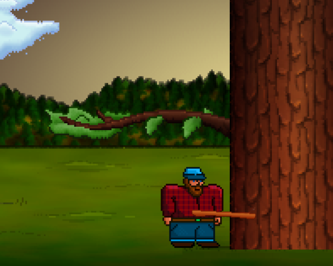
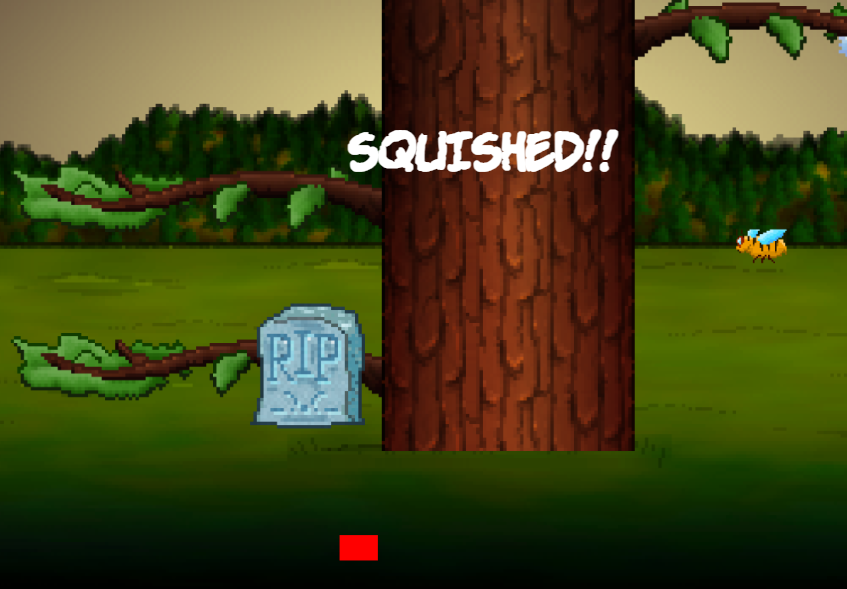

# 🌲 TimberEx

A fast-paced timber-chopping game inspired by the classic **Timberman**.  
Chop wood, dodge branches, and race against the clock!

---

## 🎮 About the Game

In **TimberEx**, you’re a skilled lumberjack with one goal: chop down the tree before time runs out — but watch out for falling branches!

- **Chop quickly** to keep the timer alive.
- **Avoid branches** or it’s game over.
- The game ends if:
  - You run out of time ⏳
  - You get hit by a branch 🌿

---

## 🕹️ How to Play

- **Enter** → Start the game.
- **Left Arrow** → Chop wood from the left side.
- **Right Arrow** → Chop wood from the right side.
- Each chop adds a little time back to the timer.

---

## ✨ Features

- Simple, addictive gameplay.
- Timer-based challenge.
- Increasing difficulty.
- Keyboard-only controls.

---





---

## 📦 Installation & Running

```bash
# Clone the repository
git clone https://github.com/jyoung4242/TimberEx.git

# Open the project folder
cd TimberEx

# Open index.html in your browser or use a local server
